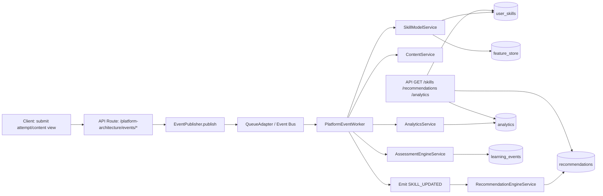

# Event-Driven Modular Architecture (Blueprint)

## 1) Services
- Auth Service: auth, session, token lifecycle
- Test Service: test lifecycle, submit attempt, adaptive question selection
- Report Service: report read model (overview, history, detail)
- Analytics Service: trend, mastery, summary updates
- Gamification Service: XP, level, streak, badges
- Recommendation Service: weak-topic driven study recommendations

## 2) Events
- TEST_STARTED
- TEST_SUBMITTED
- SCORE_UPDATED
- STREAK_UPDATED
- XP_UPDATED

Publisher: `core/events/eventPublisher.js`
Workers: `workers/*`
Queue Adapter: `core/events/queueAdapter.js` (default in-memory; pluggable to BullMQ/RabbitMQ)

## 3) Skill Mastery Engine
`modules/analytics/SkillMasteryEngine.js`
- Compute per-topic attempts/correct/accuracy
- Persist to `topic_mastery`

## 4) Passing Probability Predictor
`modules/analytics/PassingProbabilityPredictor.js`
Inputs:
- average score
- trend slope
- consistency
Output:
- probability 0-100
- band (Low/Medium/High)

## 5) Adaptive Difficulty
`modules/test/AdaptiveDifficultyEngine.js`
- Prioritize weak topics
- Enforce section blueprint
- Mix easy/medium/hard based on user profile

## 6) Data Pipeline (Test Finished)
1. Test Service emits `TEST_SUBMITTED`
2. Analytics worker computes mastery + prediction
3. Emit `SCORE_UPDATED`
4. Gamification worker updates XP + streak
5. Emit `XP_UPDATED` and `STREAK_UPDATED`
6. Recommendation updated from mastery

## 7) Database Schema (core)
- topic_mastery
- analytics_summary
- event_log
- user_progress

(Additional: user_streaks, user_xp, user_badges, study_recommendations)

## 8) Scalability Notes
- Cache read models (Redis): dashboard analytics, recommendations
- Read/Write split:
  - Write: event handlers + OLTP tables
  - Read: denormalized summary table (`analytics_summary`) + cache
- Background workers for heavy compute (queue): BullMQ/RabbitMQ/Kafka
- Startup bootstrap:
  - Register workers once in server startup (`registerAllWorkers()`)
  - Emit domain event from write path (`TEST_SUBMITTED` in test finish)

## 9) Folder Structure
```
src/
  architecture/
    core/events/
      eventTypes.js
      eventPublisher.js
      eventLogRepository.js
      queueAdapter.js
    modules/
      auth/AuthService.js
      test/TestService.js
      test/AdaptiveDifficultyEngine.js
      report/ReportService.js
      analytics/AnalyticsService.js
      analytics/SkillMasteryEngine.js
      analytics/PassingProbabilityPredictor.js
      gamification/GamificationService.js
      recommendation/RecommendationService.js
    workers/
      scoreUpdatedWorker.js
      gamificationWorker.js
      registerWorkers.js
```

## 10) Pseudocode Workflow
```pseudo
on TEST_SUBMITTED(event):
  mastery = SkillMasteryEngine.compute(event.answers)
  trend = AnalyticsService.computeTrend(event.userId)
  prediction = Predictor.predict(avgScore, trend, consistency)
  save analytics_summary
  recommendations = RecommendationService.generate(mastery)
  emit SCORE_UPDATED

on SCORE_UPDATED(event):
  xp = GamificationService.addXp(event.score)
  streak = GamificationService.updateStreak(event.userId)
  save user_xp, user_streaks
  emit XP_UPDATED
  emit STREAK_UPDATED
```

---

## 11) Silicon Valley AI EdTech Platform (Implemented)

### Service Skeleton
- Identity Service: `src/platform/services/IdentityService.js`
- Content Service: `src/platform/services/ContentService.js`
- Assessment Engine: `src/platform/services/AssessmentEngineService.js`
- Skill Model Service: `src/platform/services/SkillModelService.js`
- Recommendation Engine: `src/platform/services/RecommendationEngineService.js`
- Analytics Service: `src/platform/services/AnalyticsService.js`
- AI Tutor Service: `src/platform/services/AITutorService.js`
- Event Processor: `src/platform/events/PlatformEventProcessor.js`

### Event System
- `ATTEMPT_SUBMITTED`
- `CONTENT_VIEWED`
- `SKILL_UPDATED`

Events are published via `src/architecture/core/events/eventPublisher.js` and processed by worker `src/architecture/workers/platformEventWorker.js`.

### Data Schemas
Implemented in migration:
- `db/migrations/013_silicon_valley_platform.sql`

Tables:
- `learning_events`
- `feature_store`
- `user_skills`
- `recommendations`

### AI Logic
- Skill Scoring:
  - Implemented in `SkillModelService.computeSkillScore(...)`
  - Uses weighted accuracy, speed, confidence.
- Recommendation Logic:
  - Implemented in `RecommendationEngineService.generateForSkill(...)`
  - Produces recommendation type (`practice/review/challenge`), priority, reason, score.

### Event Flow Diagram



### API Contracts

Primary route file:
- `src/routes/platformArchitecture.js`

Contract endpoint:
- `GET /api/platform-architecture/contracts`

Core endpoints:
- `POST /api/platform-architecture/events/attempt-submitted`
- `POST /api/platform-architecture/events/content-viewed`
- `GET /api/platform-architecture/skills`
- `GET /api/platform-architecture/recommendations`
- `GET /api/platform-architecture/analytics`
- `POST /api/platform-architecture/ai-tutor/hint`

Operational monitoring endpoints:
- `GET /api/platform-architecture/event-logs` (admin)
- `GET /api/platform-architecture/event-logs/summary` (admin)
